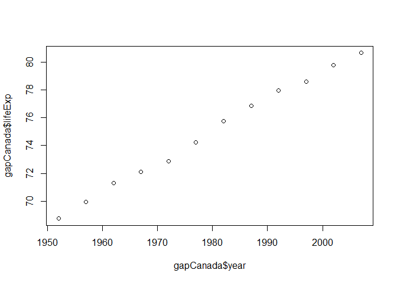

Learning Markdown
================
Jennica Nichols
September 14, 2017

Homework Assignment
===================

I am updating this form to add to my first homework assignment for class. While I would normally aim to finish this before class, I was defending my comps today. **Happy to say I passed**.

R Markdown
----------

When you click the **Knit** button a document will be generated that includes both content as well as the output of any embedded R code chunks within the document. You can embed an R code chunk like this:

``` r
summary(cars)
```

    ##      speed           dist       
    ##  Min.   : 4.0   Min.   :  2.00  
    ##  1st Qu.:12.0   1st Qu.: 26.00  
    ##  Median :15.0   Median : 36.00  
    ##  Mean   :15.4   Mean   : 42.98  
    ##  3rd Qu.:19.0   3rd Qu.: 56.00  
    ##  Max.   :25.0   Max.   :120.00

Look at gapminder data
----------------------

``` r
library(gapminder)

##look at Canada data
subset(gapminder, gapminder$country=="Canada")
```

    ##     country continent year lifeExp      pop gdpPercap
    ## 241  Canada  Americas 1952  68.750 14785584  11367.16
    ## 242  Canada  Americas 1957  69.960 17010154  12489.95
    ## 243  Canada  Americas 1962  71.300 18985849  13462.49
    ## 244  Canada  Americas 1967  72.130 20819767  16076.59
    ## 245  Canada  Americas 1972  72.880 22284500  18970.57
    ## 246  Canada  Americas 1977  74.210 23796400  22090.88
    ## 247  Canada  Americas 1982  75.760 25201900  22898.79
    ## 248  Canada  Americas 1987  76.860 26549700  26626.52
    ## 249  Canada  Americas 1992  77.950 28523502  26342.88
    ## 250  Canada  Americas 1997  78.610 30305843  28954.93
    ## 251  Canada  Americas 2002  79.770 31902268  33328.97
    ## 252  Canada  Americas 2007  80.653 33390141  36319.24

``` r
##subset Canadian life expectancy
gapCanada <- subset(gapminder, gapminder$country=="Canada")

##plot Canadian life expectancy over time
plot(gapCanada$year, gapCanada$lifeExp)
```


