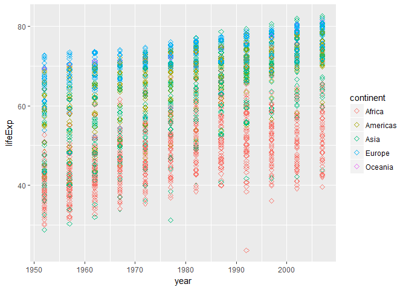
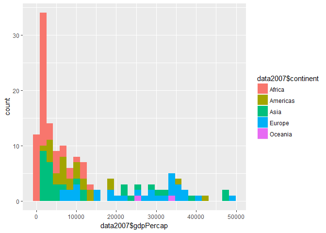
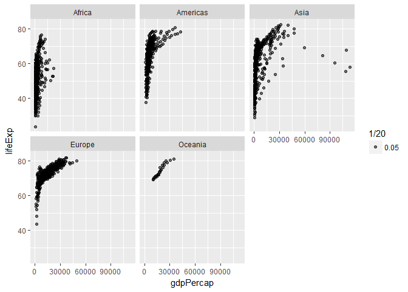

# Homework Assignment 2
By: Jennica Nichols  
September 24, 2017  
This is the second homework assignment for STAT 545 that aims to be a personal cheat sheet for exploring a new data set.


## Explore the Overall Object

**Q1. What type of object is gapfinder?**

```r
typeof(gapminder)
```

```
## [1] "list"
```
It is a list.

**Q2. What is gapminder's class?**

```r
typeof(gapminder)
```

```
## [1] "list"
```
It is "tbl_df", which has characteristics of both a table and data.frame. 

**Q3. How many variables are there?**

```r
ncol(gapminder)
```

```
## [1] 6
```
There are 6 variables.

**Q4. How many observations are there?**

```r
nrow(gapminder)
```

```
## [1] 1704
```
There are 1704 observations in the gapminder object.

**Q5. Can you get these facts about “extent” or “size” in more than one way? Can you imagine different functions being useful in different contexts?**

```r
str(gapminder)
```

```
## Classes 'tbl_df', 'tbl' and 'data.frame':	1704 obs. of  6 variables:
##  $ country  : Factor w/ 142 levels "Afghanistan",..: 1 1 1 1 1 1 1 1 1 1 ...
##  $ continent: Factor w/ 5 levels "Africa","Americas",..: 3 3 3 3 3 3 3 3 3 3 ...
##  $ year     : int  1952 1957 1962 1967 1972 1977 1982 1987 1992 1997 ...
##  $ lifeExp  : num  28.8 30.3 32 34 36.1 ...
##  $ pop      : int  8425333 9240934 10267083 11537966 13079460 14880372 12881816 13867957 16317921 22227415 ...
##  $ gdpPercap: num  779 821 853 836 740 ...
```

```r
summary(gapminder)
```

```
##         country        continent        year         lifeExp     
##  Afghanistan:  12   Africa  :624   Min.   :1952   Min.   :23.60  
##  Albania    :  12   Americas:300   1st Qu.:1966   1st Qu.:48.20  
##  Algeria    :  12   Asia    :396   Median :1980   Median :60.71  
##  Angola     :  12   Europe  :360   Mean   :1980   Mean   :59.47  
##  Argentina  :  12   Oceania : 24   3rd Qu.:1993   3rd Qu.:70.85  
##  Australia  :  12                  Max.   :2007   Max.   :82.60  
##  (Other)    :1632                                                
##       pop              gdpPercap       
##  Min.   :6.001e+04   Min.   :   241.2  
##  1st Qu.:2.794e+06   1st Qu.:  1202.1  
##  Median :7.024e+06   Median :  3531.8  
##  Mean   :2.960e+07   Mean   :  7215.3  
##  3rd Qu.:1.959e+07   3rd Qu.:  9325.5  
##  Max.   :1.319e+09   Max.   :113523.1  
## 
```
The *str* function allows you to see the number of observations and variables along with the class and name of variable. This is really helpful to get an overall sense of the object because you can also see the number of levels in a factor and some of the values in each variable (starting with the smallest). The *summary* function is helpful in a different way. For number and integer variables, it shows you key summary statistics (e.g. mean, min, max, median). For factors, it tells you the factors as well as how many observations belong to each factor.  

**Q6: What data type is each variable?**
Based on the work above, you can see the classes of the variables:
1. Country is a factor
2. Continent is a factor
3. Year is an integer
4. Life Expectancy is a number
5. Population is an integer
6. GDP per capita is a number

## Explore Individual Variables

### Understanding a categorical variable
This section explores the variable "Continent".

```r
summary(gapminder$continent) 
```

```
##   Africa Americas     Asia   Europe  Oceania 
##      624      300      396      360       24
```

```r
plot(gapminder$continent)
```

<!-- -->
Based on the summary, you can see the possible factors are: Africa, Americas, Asia, Europe, and Oceania. The plot helps you visualize the frequency of each with Africa having the most observations followed by Asia and the Europe. Oceania has the smallest number of observations. 

### Understanding a quantitative variable

This section explores the variable "Life Expectancy".

```r
summary(gapminder$lifeExp)
```

```
##    Min. 1st Qu.  Median    Mean 3rd Qu.    Max. 
##   23.60   48.20   60.71   59.47   70.85   82.60
```

```r
plot(gapminder$lifeExp~gapminder$year)
```

<!-- -->
Based on the summary, you can the mean is 59.47 years and the median is 60.71. The interquartile range is 22.65 years with a minimum value of 23.60 years and a maximum value of 82.60 years.  Based on the plot, you can see overall there is an increase in life expectancy over time, with some two major outliers. 

## Exploring Plots
This section tests out different types of plots available in the **ggplot2** package. 

### Scatterplots

```r
#load library
library(ggplot2)
```

```
## Warning: package 'ggplot2' was built under R version 3.3.2
```

```r
#scatter plot of life expectancy vs year
ggplot(gapminder, aes(x=year, y=lifeExp)) +
  geom_point(size=2, shape=23, aes(colour = continent))
```

<!-- -->

### One Quantitative Variable

```r
##subset 2007 data
data2007 <- gapminder %>%
  filter(year==2007)
```

```
## Warning: package 'bindrcpp' was built under R version 3.3.3
```

```r
##look at histogram of GDP per Capita
ggplot(data2007, aes(data2007$gdpPercap)) + 
  geom_histogram(aes(fill=data2007$continent)) 
```

```
## `stat_bin()` using `bins = 30`. Pick better value with `binwidth`.
```

<!-- -->

### Testing out faceting

```r
#make a scatterplot of GDP per capita and life expectancy
p2 <- ggplot(gapminder, aes(x=gdpPercap, y=lifeExp)) + geom_point(aes(alpha=1/20))

#Take advantage of facetting (factoring)
p2 + facet_wrap(~continent)
```

<!-- -->


## Using dplyr functions and piping

```r
#Looking at countries with the highest average life expectancy over time
  gapminder %>%
  group_by(country) %>%
  summarize(meanLife = round(mean(lifeExp), 1)) %>%
  arrange(desc(meanLife))
```

```
## # A tibble: 142 x 2
##        country meanLife
##         <fctr>    <dbl>
##  1     Iceland     76.5
##  2      Sweden     76.2
##  3      Norway     75.8
##  4 Netherlands     75.6
##  5 Switzerland     75.6
##  6      Canada     74.9
##  7       Japan     74.8
##  8   Australia     74.7
##  9     Denmark     74.4
## 10      France     74.3
## # ... with 132 more rows
```
You can see that Iceland followed closely by Sweden have the highest life expectancy over time at 76.5 years and 76.2 years respectively. Canada is 6th (74.9 years).


```r
#Looking at countries with the highest average life expectancy over time
  gapminder %>%
  group_by(country) %>%
  summarize(meanLife = round(mean(lifeExp), 1)) %>%
  arrange(meanLife)
```

```
## # A tibble: 142 x 2
##              country meanLife
##               <fctr>    <dbl>
##  1      Sierra Leone     36.8
##  2       Afghanistan     37.5
##  3            Angola     37.9
##  4     Guinea-Bissau     39.2
##  5        Mozambique     40.4
##  6           Somalia     41.0
##  7            Rwanda     41.5
##  8           Liberia     42.5
##  9 Equatorial Guinea     43.0
## 10            Guinea     43.2
## # ... with 132 more rows
```
The countries with the lowest life expectancy over time are Sierra Leone (36.8 years), Afghanistan (37.5 years), and Angola (37.9 years). 


```r
gapminder %>%
  filter(country %in% c("Canada", "Sierra Leone", "Iceland"), year == 2007)
```

```
## # A tibble: 3 x 6
##        country continent  year lifeExp      pop  gdpPercap
##         <fctr>    <fctr> <int>   <dbl>    <int>      <dbl>
## 1       Canada  Americas  2007  80.653 33390141 36319.2350
## 2      Iceland    Europe  2007  81.757   301931 36180.7892
## 3 Sierra Leone    Africa  2007  42.568  6144562   862.5408
```
Looking at the latest data (2007), you can see that Iceland has a life expectancy of 81.8 years while Sierra Leone's life expectancy is 42.6. That is a 39.2 year difference!  Canada's life expectancy in 2007 is 80.7 years. 
