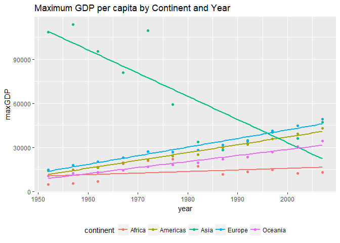
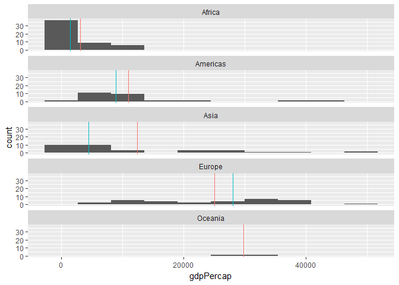
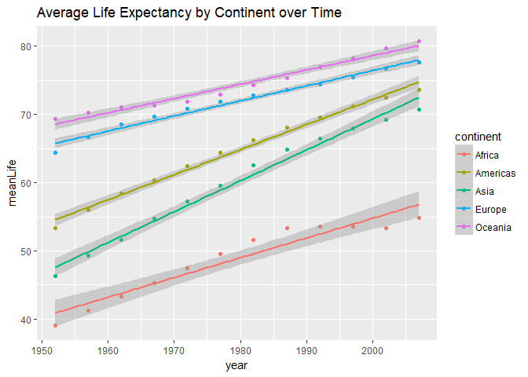

# Homework Assignment 3
By: Jennica Nichols  
October 1, 2017  
The purpose of this assignment is to get more familiar using **dplyr** and **ggplot2** packages to explore a data set. **Gapminder** will be the data set used for this work. Each question will include at least one table and graph to help to answer the question.


```r
library(gapminder)
library(dplyr)
library(ggplot2)
```

## Question 1: What is the maximum and minimum of GDP per capita for all continents?


```r
# load library
library(gridExtra)

# create new dataset wuth minGDP and maxGDP variables that determine min and max GDP per capita by continent and year
continentGDP <- 
gapminder %>%
 group_by(continent, year) %>%
  summarise(minGDP=min(gdpPercap), maxGDP=max(gdpPercap))
  
# min GDP per capita by continent (regardless of year)
round(by(continentGDP$minGDP, continentGDP$continent, min), 2)
```

```
## continentGDP$continent: Africa
## [1] 241.17
## -------------------------------------------------------- 
## continentGDP$continent: Americas
## [1] 1201.64
## -------------------------------------------------------- 
## continentGDP$continent: Asia
## [1] 331
## -------------------------------------------------------- 
## continentGDP$continent: Europe
## [1] 973.53
## -------------------------------------------------------- 
## continentGDP$continent: Oceania
## [1] 10039.6
```

```r
# max per capita by continent (regardless of year)
round(by(continentGDP$maxGDP, continentGDP$continent, max),2)
```

```
## continentGDP$continent: Africa
## [1] 21951.21
## -------------------------------------------------------- 
## continentGDP$continent: Americas
## [1] 42951.65
## -------------------------------------------------------- 
## continentGDP$continent: Asia
## [1] 113523.1
## -------------------------------------------------------- 
## continentGDP$continent: Europe
## [1] 49357.19
## -------------------------------------------------------- 
## continentGDP$continent: Oceania
## [1] 34435.37
```
The lowest GDP per capita by continent is Africa at $241.17/person while the highest is in the Oceania at $10,039.60/person. To better understand the trend of GDP per capita by continent, I wanted to explore the variable by continent and year. 


```r
# min by continent and year
as.table(round(by(continentGDP$minGDP, continentGDP[,1:2], min), 2))
```

```
##           year
## continent      1952     1957     1962     1967     1972     1977     1982
##   Africa     298.85   336.00   355.20   412.98   464.10   502.32   462.21
##   Americas  1397.72  1544.40  1662.14  1452.06  1654.46  1874.30  2011.16
##   Asia       331.00   350.00   388.00   349.00   357.00   371.00   424.00
##   Europe     973.53  1353.99  1709.68  2172.35  2860.17  3528.48  3630.88
##   Oceania  10039.60 10949.65 12217.23 14463.92 16046.04 16233.72 17632.41
##           year
## continent      1987     1992     1997     2002     2007
##   Africa     389.88   410.90   312.19   241.17   277.55
##   Americas  1823.02  1456.31  1341.73  1270.36  1201.64
##   Asia       385.00   347.00   415.00   611.00   944.00
##   Europe    3738.93  2497.44  3193.05  4604.21  5937.03
##   Oceania  19007.19 18363.32 21050.41 23189.80 25185.01
```

```r
# max by continent and year
as.table(round(by(continentGDP$maxGDP, continentGDP[,1:2], max), 2))
```

```
##           year
## continent       1952      1957      1962      1967      1972      1977
##   Africa     4725.30   5487.10   6757.03  18772.75  21011.50  21951.21
##   Americas  13990.48  14847.13  16173.15  19530.37  21806.04  24072.63
##   Asia     108382.35 113523.13  95458.11  80894.88 109347.87  59265.48
##   Europe    14734.23  17909.49  20431.09  22966.14  27195.11  26982.29
##   Oceania   10556.58  12247.40  13175.68  14526.12  16788.63  18334.20
##           year
## continent       1982      1987      1992      1997      2002      2007
##   Africa    17364.28  11864.41  13522.16  14722.84  12521.71  13206.48
##   Americas  25009.56  29884.35  32003.93  35767.43  39097.10  42951.65
##   Asia      33693.18  28118.43  34932.92  40300.62  36023.11  47306.99
##   Europe    28397.72  31540.97  33965.66  41283.16  44683.98  49357.19
##   Oceania   19477.01  21888.89  23424.77  26997.94  30687.75  34435.37
```

```r
# plot minGDP and maxGDP  
 plot1<- ggplot(continentGDP, aes(year, minGDP,
                      colour=continent)) +
    geom_point() +
    theme(legend.position="bottom") +
    geom_smooth(method="lm", se=FALSE) +
    ggtitle("Minimum GDP per capita by Continent and Year") 
    
  plot2 <- ggplot(continentGDP, aes(year, maxGDP,
                      colour=continent)) +
    geom_point() +
    theme(legend.position="bottom") +
    geom_smooth(method="lm", se=FALSE) +
    ggtitle("Maximum GDP per capita by Continent and Year")

# print plots
print(plot1)
```

<!-- -->
   
Based on the plot, you can see the minimum increased for Oceania, Europe,and Asia over time while the Americans look to have decreased overtime. Africa was increasing from 1952 to 1977, but then the trend decreases with the minimum GDP per capita in 2007 ($277.55/person) less than it was in 1952 (i.e. $298.85/person).


```r
print(plot2)
```

<!-- -->
  
Based on the plot, the maximum GDP has been increasing for all continents except Asia. Asia has a decreasing trend in the top GDP per capita over time. 

## Question 2: What is the spread of GDP per capita within the continents?
For this question, I decided to look at the spread of GDP per capita for all countries in the most recent year (2007).

```r
#create dataset of only 2007 and calcuate median gdpPerCap by continent
gap2007 <- gapminder %>%
  filter(year == 2007) %>%
  group_by(continent) %>%
  mutate(median = median(gdpPercap), mean = mean(gdpPercap))
  
#plot results  
plot3 <- ggplot(gap2007, aes(gdpPercap))
plot3 + geom_histogram(bins=10) + facet_wrap(~continent, ncol=1) +
  geom_vline(aes(xintercept = median, colour = "Red"), show.legend = FALSE) +
  geom_vline(aes(xintercept = mean, colour = "Blue"), show.legend = FALSE)
```

<!-- -->
  
In 2007, GDP per capita was plotted by continent as a histogram to understand distribution. Two vertical lines were added to show median (blue) and mean (red) to better understand the distribution. The graph highlights that Africa has a large majority of its countries' GDP per capita rates on the far right, with the lowest median and mean values of all the continents. Asia has the widest distribution of GDP per capita among its countries, with the second lowest median highlighting more countries have a low GDP per capita rate. Europe is the only continent with a right skew, which means it is the only continent where the median is greater than the mean. Oceania only had two observations and therefore the mean and median are the same value.  

# Question 3: How has life expectancy changing over time on different continents?

```r
#Look at mean and median per continent (across all years)
gapminder %>%
  group_by(continent) %>%
  summarise(meanLife = round(mean(lifeExp),1), medianLife = round(median(lifeExp),1))
```

```
## # A tibble: 5 x 3
##   continent meanLife medianLife
##      <fctr>    <dbl>      <dbl>
## 1    Africa     48.9       47.8
## 2  Americas     64.7       67.0
## 3      Asia     60.1       61.8
## 4    Europe     71.9       72.2
## 5   Oceania     74.3       73.7
```

```r
#Create data set that includes mean and median by continent and year
  life <-
  gapminder %>%
  group_by(continent, year) %>%
  summarise(meanLife = round(mean(lifeExp),1), medianLife = round(median(lifeExp),1)) 

#modify data set so only one observation per continent per year  
  life <- life %>%
    group_by(continent) %>%
    mutate(year = unique(year))

#plot data
ggplot(life, aes(year, meanLife, colour = continent)) +
  geom_point() +
  geom_smooth(method="lm", se= TRUE) +
  ggtitle("Average Life Expectancy by Continent over Time")
```

<!-- -->
  
From the graph, you can see that across all continents the average life expectancy has a positive trend (i.e. is increasing over time). Moreover, continents remain in the same rank relative to each over across the time period. For example, Africa has the lowest average life expectancy across all data points while Oceania has the highest over this same time period. Asia appears to have the highest rate of increase with the largest slope. Asia, Americas and Africa appear all appear to have average life expediencies that are below the trend line after 1996, which may be due to the HIV/AIDS pandemic as these continents were hit especially hard during this time period. To investigate this further, I looked at the range in average life expectancy by continent across all time periods. 

```r
#determine range between lowest average life expectancy and highest average life expectancy by continent  
  life %>%
    group_by(continent) %>%
    summarise(Difference = max(meanLife) - min(meanLife)) 
```

```
## # A tibble: 5 x 2
##   continent Difference
##      <fctr>      <dbl>
## 1    Africa       15.7
## 2  Americas       20.3
## 3      Asia       24.4
## 4    Europe       13.2
## 5   Oceania       11.4
```
  
Asia has the highest range in average life expectancy (24.4 years) followed by the Americas (20.3 years). Oceania has the lowest range at 11.4 years. 

# Reflections
This exercise helped me to better understand the power of dplyr and piping. You can do a lot of significant steps all within a few lines a code and without needing to create new variables. That said, I had to practice and look at different entries in Stack Overflow to better understand how the function summarise() worked in order to apply it to my own work. Lastly, I found the graphing to be quite powerful. I had used this package before, but I had the opportunity to try new things that made me appreciate its power even more. For example, I learned how to add vertical lines to the ggplot2 graph that was based on mean and median lines, which is really helpful when comparing across different facets as well as to help me understand how the data was skewed. I found [here](http://URL HERE) very informative on how to do this.  
