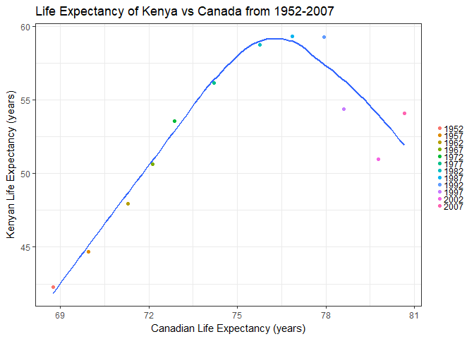

# Homework Assignment 4
By: Jennica Nichols  
October 10, 2017  

Homework Assignment 4 is focused on tidying data and joining datasets. It uses the **gapminder** dataset to do tasks. 


```r
## load librarys
library(tidyverse)
library(gapminder)
```

## Tidying data: Mission 1
1. Make a tibble with one row per year and columns for life expectancy for two or more countries. 

```r
#create Canada dataset
Canada <-
gapminder %>%
  filter(country=="Canada") %>%
  select(year, country, lifeExp, -continent, -pop, -gdpPercap)

#create Kenya dataset
Kenya <-
gapminder %>%
  filter(country=="Kenya") %>%
  select(year, country, lifeExp, -continent, -pop, -gdpPercap)

#join dataset to create 1
lifeExp <- inner_join(Canada, Kenya, by="year")
```

2. Use knitr::kable() to make this table look pretty in your rendered homework. 

```r
# load library
library(knitr)
```

```
## Warning: package 'knitr' was built under R version 3.3.2
```

```r
knitr::kable(lifeExp, format= "html", 
             digits = 2,
             align = "c",
             col.names = c("Year", "Country_A", "lifeExp_A", "Country_B", "lifeExp_B"))
```

<table>
 <thead>
  <tr>
   <th style="text-align:center;"> Year </th>
   <th style="text-align:center;"> Country_A </th>
   <th style="text-align:center;"> lifeExp_A </th>
   <th style="text-align:center;"> Country_B </th>
   <th style="text-align:center;"> lifeExp_B </th>
  </tr>
 </thead>
<tbody>
  <tr>
   <td style="text-align:center;"> 1952 </td>
   <td style="text-align:center;"> Canada </td>
   <td style="text-align:center;"> 68.75 </td>
   <td style="text-align:center;"> Kenya </td>
   <td style="text-align:center;"> 42.27 </td>
  </tr>
  <tr>
   <td style="text-align:center;"> 1957 </td>
   <td style="text-align:center;"> Canada </td>
   <td style="text-align:center;"> 69.96 </td>
   <td style="text-align:center;"> Kenya </td>
   <td style="text-align:center;"> 44.69 </td>
  </tr>
  <tr>
   <td style="text-align:center;"> 1962 </td>
   <td style="text-align:center;"> Canada </td>
   <td style="text-align:center;"> 71.30 </td>
   <td style="text-align:center;"> Kenya </td>
   <td style="text-align:center;"> 47.95 </td>
  </tr>
  <tr>
   <td style="text-align:center;"> 1967 </td>
   <td style="text-align:center;"> Canada </td>
   <td style="text-align:center;"> 72.13 </td>
   <td style="text-align:center;"> Kenya </td>
   <td style="text-align:center;"> 50.65 </td>
  </tr>
  <tr>
   <td style="text-align:center;"> 1972 </td>
   <td style="text-align:center;"> Canada </td>
   <td style="text-align:center;"> 72.88 </td>
   <td style="text-align:center;"> Kenya </td>
   <td style="text-align:center;"> 53.56 </td>
  </tr>
  <tr>
   <td style="text-align:center;"> 1977 </td>
   <td style="text-align:center;"> Canada </td>
   <td style="text-align:center;"> 74.21 </td>
   <td style="text-align:center;"> Kenya </td>
   <td style="text-align:center;"> 56.16 </td>
  </tr>
  <tr>
   <td style="text-align:center;"> 1982 </td>
   <td style="text-align:center;"> Canada </td>
   <td style="text-align:center;"> 75.76 </td>
   <td style="text-align:center;"> Kenya </td>
   <td style="text-align:center;"> 58.77 </td>
  </tr>
  <tr>
   <td style="text-align:center;"> 1987 </td>
   <td style="text-align:center;"> Canada </td>
   <td style="text-align:center;"> 76.86 </td>
   <td style="text-align:center;"> Kenya </td>
   <td style="text-align:center;"> 59.34 </td>
  </tr>
  <tr>
   <td style="text-align:center;"> 1992 </td>
   <td style="text-align:center;"> Canada </td>
   <td style="text-align:center;"> 77.95 </td>
   <td style="text-align:center;"> Kenya </td>
   <td style="text-align:center;"> 59.28 </td>
  </tr>
  <tr>
   <td style="text-align:center;"> 1997 </td>
   <td style="text-align:center;"> Canada </td>
   <td style="text-align:center;"> 78.61 </td>
   <td style="text-align:center;"> Kenya </td>
   <td style="text-align:center;"> 54.41 </td>
  </tr>
  <tr>
   <td style="text-align:center;"> 2002 </td>
   <td style="text-align:center;"> Canada </td>
   <td style="text-align:center;"> 79.77 </td>
   <td style="text-align:center;"> Kenya </td>
   <td style="text-align:center;"> 50.99 </td>
  </tr>
  <tr>
   <td style="text-align:center;"> 2007 </td>
   <td style="text-align:center;"> Canada </td>
   <td style="text-align:center;"> 80.65 </td>
   <td style="text-align:center;"> Kenya </td>
   <td style="text-align:center;"> 54.11 </td>
  </tr>
</tbody>
</table>

3. Take advantage of this new data shape to scatterplot life expectancy for one country against that of another.

```r
p <- ggplot(lifeExp, aes(x= lifeExp.x, y= lifeExp.y))
p + geom_point(aes(colour = factor(year))) +
  geom_smooth(se=FALSE) +
  labs(x = "Canadian Life Expectancy (years)", 
       y = "Kenyan Life Expectancy (years)",
       title = "Life Expectancy of Kenya vs Canada from 1952-2007") +
  theme_bw()+
  theme(legend.position = "right",
        legend.title = element_blank(),
        legend.key.size = unit(0.1, "cm"))
```

<!-- -->
  
You can see from the above graph, both countries had an increase in their life expectancies from 1952 until 1987 as shown by the positive linear trend. After this, Kenya had a drop in their life expectancy over the next 4 time points while Canada continued to have a positive increase during this time. 

## Join, Merge, Look Up: Mission 2
1. Create a second data frame, complementary to Gapminder.

```r
# load library
library(forcats)
```

```
## Warning: package 'forcats' was built under R version 3.3.3
```

```r
#create tribble
(Travelling <- 
  tibble(
  country = factor(c("Canada", "Australia", "Kenya", "Tanzania", "Indonesia", "France", "Poland", "Rwanda", "Vatican City")), 
  travelled = c("Yes", "Yes", "Yes", "Yes", "Yes", "Yes", "No", "No", "Yes"), 
  lived = c("Yes", "No", "Yes", "Yes", "No", "No", "No", "No", "No")))
```

```
## # A tibble: 9 x 3
##        country travelled lived
##         <fctr>     <chr> <chr>
## 1       Canada       Yes   Yes
## 2    Australia       Yes    No
## 3        Kenya       Yes   Yes
## 4     Tanzania       Yes   Yes
## 5    Indonesia       Yes    No
## 6       France       Yes    No
## 7       Poland        No    No
## 8       Rwanda        No    No
## 9 Vatican City       Yes    No
```

2. Join this with (part of) Gapminder using a  dplyr join function and make some observations about the process and result. Explore the different types of joins. 

```r
left_join(gapminder, Travelling, by="country")
```

```
## # A tibble: 1,704 x 8
##        country continent  year lifeExp      pop gdpPercap travelled lived
##          <chr>    <fctr> <int>   <dbl>    <int>     <dbl>     <chr> <chr>
##  1 Afghanistan      Asia  1952  28.801  8425333  779.4453      <NA>  <NA>
##  2 Afghanistan      Asia  1957  30.332  9240934  820.8530      <NA>  <NA>
##  3 Afghanistan      Asia  1962  31.997 10267083  853.1007      <NA>  <NA>
##  4 Afghanistan      Asia  1967  34.020 11537966  836.1971      <NA>  <NA>
##  5 Afghanistan      Asia  1972  36.088 13079460  739.9811      <NA>  <NA>
##  6 Afghanistan      Asia  1977  38.438 14880372  786.1134      <NA>  <NA>
##  7 Afghanistan      Asia  1982  39.854 12881816  978.0114      <NA>  <NA>
##  8 Afghanistan      Asia  1987  40.822 13867957  852.3959      <NA>  <NA>
##  9 Afghanistan      Asia  1992  41.674 16317921  649.3414      <NA>  <NA>
## 10 Afghanistan      Asia  1997  41.763 22227415  635.3414      <NA>  <NA>
## # ... with 1,694 more rows
```
**left_join()** adds the columns from the traveling dataset to the gapminder dataset based on country. All observations from gapminder are included, where countries not listed in the traveling dataset have N/A for the new columns. It does not include countries in the traveling dataset that are not in gapminder. This would be helpful if I wanted to do an analysis that involved not losing observations from the gapminder dataset.


```r
right_join(gapminder, Travelling, by="country")
```

```
## # A tibble: 97 x 8
##    country continent  year lifeExp      pop gdpPercap travelled lived
##      <chr>    <fctr> <int>   <dbl>    <int>     <dbl>     <chr> <chr>
##  1  Canada  Americas  1952   68.75 14785584  11367.16       Yes   Yes
##  2  Canada  Americas  1957   69.96 17010154  12489.95       Yes   Yes
##  3  Canada  Americas  1962   71.30 18985849  13462.49       Yes   Yes
##  4  Canada  Americas  1967   72.13 20819767  16076.59       Yes   Yes
##  5  Canada  Americas  1972   72.88 22284500  18970.57       Yes   Yes
##  6  Canada  Americas  1977   74.21 23796400  22090.88       Yes   Yes
##  7  Canada  Americas  1982   75.76 25201900  22898.79       Yes   Yes
##  8  Canada  Americas  1987   76.86 26549700  26626.52       Yes   Yes
##  9  Canada  Americas  1992   77.95 28523502  26342.88       Yes   Yes
## 10  Canada  Americas  1997   78.61 30305843  28954.93       Yes   Yes
## # ... with 87 more rows
```
**right_join()** adds the columns from the gapminder dataset to the travling dataset based on country. Countries not listed in the traveling dataset but in the gapminder dataset have been excluded from the join. All rows from traveling are maintained using this function. This would be helpful if I wanted to do an analysis that did not lose any observations from the traveling dataset. 


```r
inner_join(gapminder, Travelling, by="country")
```

```
## Warning: Column `country` joining factors with different levels, coercing
## to character vector
```

```
## # A tibble: 96 x 8
##      country continent  year lifeExp      pop gdpPercap travelled lived
##        <chr>    <fctr> <int>   <dbl>    <int>     <dbl>     <chr> <chr>
##  1 Australia   Oceania  1952   69.12  8691212  10039.60       Yes    No
##  2 Australia   Oceania  1957   70.33  9712569  10949.65       Yes    No
##  3 Australia   Oceania  1962   70.93 10794968  12217.23       Yes    No
##  4 Australia   Oceania  1967   71.10 11872264  14526.12       Yes    No
##  5 Australia   Oceania  1972   71.93 13177000  16788.63       Yes    No
##  6 Australia   Oceania  1977   73.49 14074100  18334.20       Yes    No
##  7 Australia   Oceania  1982   74.74 15184200  19477.01       Yes    No
##  8 Australia   Oceania  1987   76.32 16257249  21888.89       Yes    No
##  9 Australia   Oceania  1992   77.56 17481977  23424.77       Yes    No
## 10 Australia   Oceania  1997   78.83 18565243  26997.94       Yes    No
## # ... with 86 more rows
```
**inner_join()** only includes observations that have a country in both gapminder and travelling. This join would be helpful if I wanted to do an analysis that only included observations that were both datasets. 


```r
intersect(gapminder$country, Travelling$country)
```

```
## [1] "Australia" "Canada"    "France"    "Indonesia" "Kenya"     "Poland"   
## [7] "Rwanda"    "Tanzania"
```
**intersect()** only works for comparing columns that match and therefore I had to focus the join on the only shared column between gapminder and traveling (i.e. country). This shows me the countries that are in both datasets. 


```r
union(gapminder$country, Travelling$country)
```

```
##   [1] "Afghanistan"              "Albania"                 
##   [3] "Algeria"                  "Angola"                  
##   [5] "Argentina"                "Australia"               
##   [7] "Austria"                  "Bahrain"                 
##   [9] "Bangladesh"               "Belgium"                 
##  [11] "Benin"                    "Bolivia"                 
##  [13] "Bosnia and Herzegovina"   "Botswana"                
##  [15] "Brazil"                   "Bulgaria"                
##  [17] "Burkina Faso"             "Burundi"                 
##  [19] "Cambodia"                 "Cameroon"                
##  [21] "Canada"                   "Central African Republic"
##  [23] "Chad"                     "Chile"                   
##  [25] "China"                    "Colombia"                
##  [27] "Comoros"                  "Congo, Dem. Rep."        
##  [29] "Congo, Rep."              "Costa Rica"              
##  [31] "Cote d'Ivoire"            "Croatia"                 
##  [33] "Cuba"                     "Czech Republic"          
##  [35] "Denmark"                  "Djibouti"                
##  [37] "Dominican Republic"       "Ecuador"                 
##  [39] "Egypt"                    "El Salvador"             
##  [41] "Equatorial Guinea"        "Eritrea"                 
##  [43] "Ethiopia"                 "Finland"                 
##  [45] "France"                   "Gabon"                   
##  [47] "Gambia"                   "Germany"                 
##  [49] "Ghana"                    "Greece"                  
##  [51] "Guatemala"                "Guinea"                  
##  [53] "Guinea-Bissau"            "Haiti"                   
##  [55] "Honduras"                 "Hong Kong, China"        
##  [57] "Hungary"                  "Iceland"                 
##  [59] "India"                    "Indonesia"               
##  [61] "Iran"                     "Iraq"                    
##  [63] "Ireland"                  "Israel"                  
##  [65] "Italy"                    "Jamaica"                 
##  [67] "Japan"                    "Jordan"                  
##  [69] "Kenya"                    "Korea, Dem. Rep."        
##  [71] "Korea, Rep."              "Kuwait"                  
##  [73] "Lebanon"                  "Lesotho"                 
##  [75] "Liberia"                  "Libya"                   
##  [77] "Madagascar"               "Malawi"                  
##  [79] "Malaysia"                 "Mali"                    
##  [81] "Mauritania"               "Mauritius"               
##  [83] "Mexico"                   "Mongolia"                
##  [85] "Montenegro"               "Morocco"                 
##  [87] "Mozambique"               "Myanmar"                 
##  [89] "Namibia"                  "Nepal"                   
##  [91] "Netherlands"              "New Zealand"             
##  [93] "Nicaragua"                "Niger"                   
##  [95] "Nigeria"                  "Norway"                  
##  [97] "Oman"                     "Pakistan"                
##  [99] "Panama"                   "Paraguay"                
## [101] "Peru"                     "Philippines"             
## [103] "Poland"                   "Portugal"                
## [105] "Puerto Rico"              "Reunion"                 
## [107] "Romania"                  "Rwanda"                  
## [109] "Sao Tome and Principe"    "Saudi Arabia"            
## [111] "Senegal"                  "Serbia"                  
## [113] "Sierra Leone"             "Singapore"               
## [115] "Slovak Republic"          "Slovenia"                
## [117] "Somalia"                  "South Africa"            
## [119] "Spain"                    "Sri Lanka"               
## [121] "Sudan"                    "Swaziland"               
## [123] "Sweden"                   "Switzerland"             
## [125] "Syria"                    "Taiwan"                  
## [127] "Tanzania"                 "Thailand"                
## [129] "Togo"                     "Trinidad and Tobago"     
## [131] "Tunisia"                  "Turkey"                  
## [133] "Uganda"                   "United Kingdom"          
## [135] "United States"            "Uruguay"                 
## [137] "Venezuela"                "Vietnam"                 
## [139] "West Bank and Gaza"       "Yemen, Rep."             
## [141] "Zambia"                   "Zimbabwe"                
## [143] "Vatican City"
```
**union()** only works for comparing columns that match and therefore I had to focus on the only shared column between gapminder and traveling (i.e. country). This shows me all the unique observations in both data sets and therefore shows all possibilities (i.e. countries only in the traveling dataset, countries only in the gapminder dataset, and countries in both datasets).


```r
setdiff(Travelling$country, gapminder$country)
```

```
## [1] "Vatican City"
```
**setdiff()** only works for comparing columns that match and therefore I had to focus the join on the only shared column between gapminder and traveling (i.e. country). This shows me the countries that are in the travelling dataset and not in gapminder dataset. There is only one country.

intersect(), union(), and setdiff() are all useful in trying to understand how much overlap exists between the joining variable for two datasets (in this case, country). 


```r
semi_join(gapminder, Travelling)
```

```
## Joining, by = "country"
```

```
## Warning: Column `country` joining factors with different levels, coercing
## to character vector
```

```
## # A tibble: 96 x 6
##      country continent  year lifeExp      pop gdpPercap
##       <fctr>    <fctr> <int>   <dbl>    <int>     <dbl>
##  1 Australia   Oceania  1952   69.12  8691212  10039.60
##  2 Australia   Oceania  1957   70.33  9712569  10949.65
##  3 Australia   Oceania  1962   70.93 10794968  12217.23
##  4 Australia   Oceania  1967   71.10 11872264  14526.12
##  5 Australia   Oceania  1972   71.93 13177000  16788.63
##  6 Australia   Oceania  1977   73.49 14074100  18334.20
##  7 Australia   Oceania  1982   74.74 15184200  19477.01
##  8 Australia   Oceania  1987   76.32 16257249  21888.89
##  9 Australia   Oceania  1992   77.56 17481977  23424.77
## 10 Australia   Oceania  1997   78.83 18565243  26997.94
## # ... with 86 more rows
```
**semi_join()** subsets the gapminder dataset by only including countries that are in the Travelling dataset. It does not actually join the two datasets together. This could be helpful when doing an analysis that does not require the two datasets to be merged together, but does require subsetting one dataframe based on another. 


```r
anti_join(Travelling, gapminder)
```

```
## Joining, by = "country"
```

```
## Warning: Column `country` joining factors with different levels, coercing
## to character vector
```

```
## # A tibble: 1 x 3
##        country travelled lived
##         <fctr>     <chr> <chr>
## 1 Vatican City       Yes    No
```
**anti_join()** subsets the traveling dataset to only include those observations that are not in gapminder without actually joining the two datasets together. This would be helpful to understand observations that are mutually exclusive in one dataset based on another. 

## Reflections
* **Mission 1**:
    * I liked the challenge of trying to tidy the gapminder dataframe. 
    * I struggled trying to create a scatterplot that told a complete story. Since it was comparing two countries over time, I wanted to make the fill be the years (otherwise I didn't think the visual made much sense). The "year" variable was an interger and therefore continuous. The continuous scale made it hard to distinguish visually the years. Also, there were too many points to make unique shapes. I therefore created a legend that converted year to a factor, which utilized more colours making it a lot easier to tell years. 
    
* **Mission 2**:
    * It was harder than I thought it would be to create a second dataset to practice joining. 
    * Working through the different join options made me better understand how I can use them. For example, subsetting using anti_join() and semi_join() could be really handy as they don't actually join the tables yet ensure you are only working with a subset related to the second table. 
