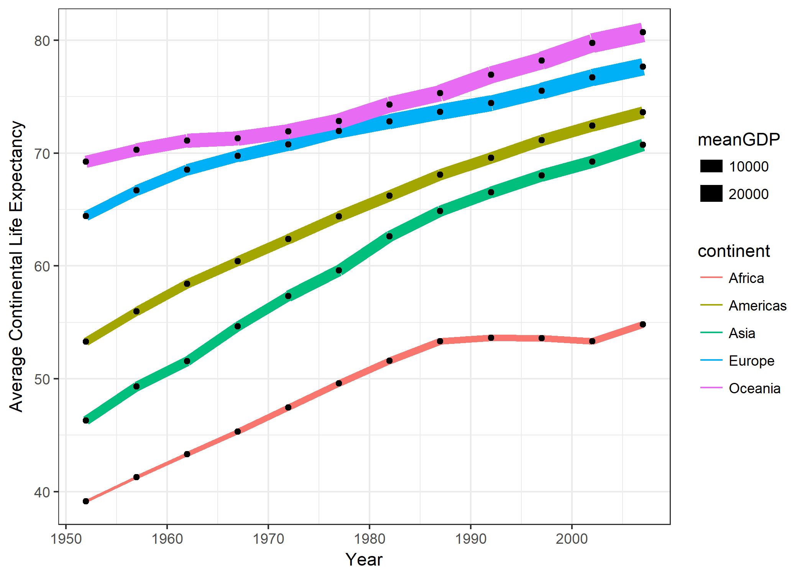
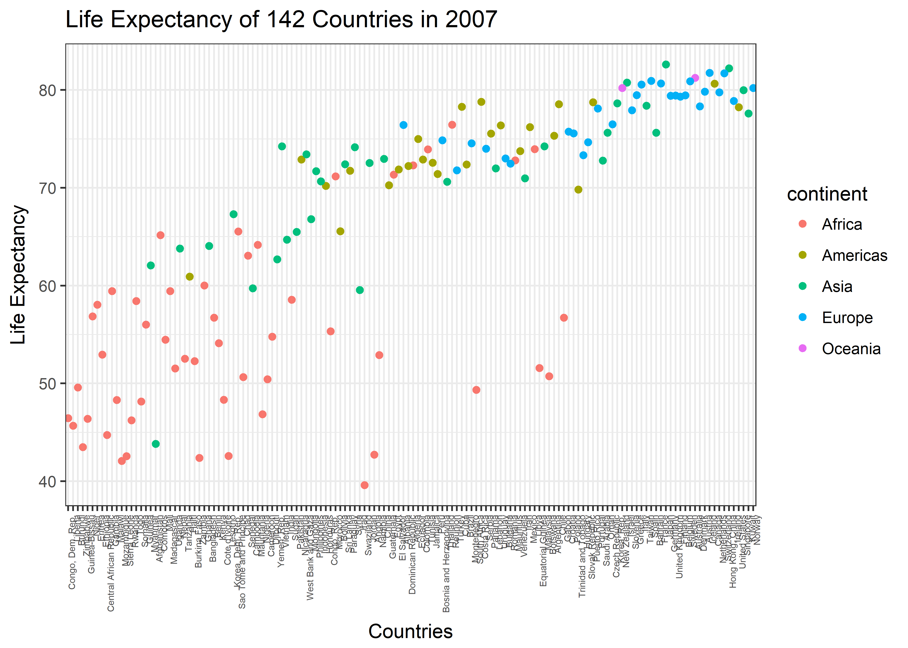

This is the fifth and final homework assignment for STAT 545.

# Factor Management
The goal of this section is to (i) define factor variables, (ii) drop factor levels, and (iii) reorder levels. I will be using the **gapminder** data set.

## Task 1
**Drop Oceania.** Filter the Gapminder data to remove observations associated with the continent of Oceania. Additionally, remove unused factor levels. Provide concrete information on the data before and after removing these rows and Oceania; address the number of rows and the levels of the affected factors.
```{r warning = FALSE, message = FALSE}
# load libraries
library(gapminder)
library(tidyverse)

# Before changing factors
str(gapminder)
summary(gapminder)

```
Without any manipulation, the data set has 1704 observations with 142 countries included. The average life expectancy is 59.47 years (median = 60.71 years) showing a slight right skew. The average GDP per capita is $7,215 dollars per person (median = $3,532 per person) showing a significant left skew in the data. 

```{r}

#filter out Oceania and drop unused factors; describe new dataset
str(gapminder %>%
  filter(continent != "Oceania") %>%
  droplevels())

summary(gapminder %>%
  filter(continent != "Oceania") %>%
  droplevels())

```
When you filter the data to remove Oceania, you have a slightly smaller data set with 1608 observations. The continent variable now has 4 instead of 5 levels. In this subset, you have 140 countries included meaning two have been removed. The average life expectancy is 59.26 years (median = 60.34 years), which is marginally less than the overall data set. The min and max of life expectancy is the same as the overall data set. The average and median GDP per capita are lower at $7, 052 dollars per person and $3, 450 per person respectively. The min and max GDP per capita are the same as the overall data set. 

## Task 2
**Reorder the levels of country or continent.** Use the forcats package to change the order of the factor levels, based on a principled summary of one of the quantitative variables. Consider experimenting with a summary statistic beyond the most basic choice of the median.

```{r warning = FALSE, message = FALSE}
#load library
library(forcats)

#reorder continent factors based on mean gdpPercap and visualize
  gapminder %>%
  ggplot(aes(fct_reorder(continent, gdpPercap, fun = mean), lifeExp)) +
  geom_point(aes(colour = year))
  
#reorder continent factors based on min gdpPercap and visualize
  gapminder %>%
  ggplot(aes(fct_reorder(continent, gdpPercap, fun = min), lifeExp)) +
  geom_point(aes(colour = year))  
  
#reorder continent factors based on max lifeExp and visualize
  gapminder %>%
  ggplot(aes(fct_reorder(continent, gdpPercap, fun = IQR), lifeExp)) +
  geom_point(aes(colour = year))  

```
I first tried to reorder the continent variable based on mean GDP per capita. When visualized, this put Africa first and Oceania last meaning that Africa has the lowest average GDP per capita and Oceania had the highest average GDP per capita. In my second attempt, I reordered the continent variable based on minimum GDP per capita and visualized it. Africa again was first meaning it had the lowest minimum GDP per capita of all the continents and Oceania was last meaning it had the largest minimum GDP per capita. The order of the other continents was different between the two graphs showing there was a difference between average GDP per capita and minimum GDP per capita. Lastly, I tried reordering the continent variable based on the interquartile range (IQR) of GDP per capita. Africa was first meaning it had the smallest IQR of all the continents and Europe was last meaning it had the largest IQR of all the continents. 

## Task 3
Explore the effects of arrange().Note: these explorations should involve the data, the factor levels, and some figures.
1. Does merely arranging the data have any effect on, say, a figure?
```{r}

#original data set
gapminder

gapminder %>%
  ggplot(aes(continent, lifeExp)) +
  geom_point(aes(colour = year)) 

#arranging by gdpPercap

gapminder %>%
  arrange(gdpPercap)

gapminder %>%
  arrange(gdpPercap) %>%
  ggplot(aes(continent, lifeExp)) +
  geom_point(aes(colour = year)) 
  
```
Based on the above exploration, the arrange() function reorganized the table observations based on the variable selected. In this case, it rearranged the original table (which was alphabetical based on country) to be in order based on gdpPercap variable. The first row therefore had the lowest GDP per capta. The tables therefore looked very different. When you look at the graphs though, you see that they are the same. While the underlying data table is different, both graphs are grouped by continent and look at life expectancy thus the graphs appear the same.  
  
2.  Explore the effects of reordering a factor and factor reordering coupled with arrange(). Especially, what effect does this have on a figure?
```{r}
#create a subset of data from only 2007
gap2007 <- 
  gapminder %>%
  filter(year == 2007)

#check the order of country variable
head(summary(gap2007$country), 10)

#reorder factor by gdpPercap
gap2007$country <- fct_reorder(gap2007$country, gap2007$gdpPercap, fun = min)

#check the order of country variable
head(summary(gap2007$country), 10)
```
I first created a subset of observations from 2007. I then looked at the original factor order for the country variable, which was alphabetical starting with Afghantistan, Albania etc. I then reordered the factor based on minimum GDP per capita and relooked at the country variable. The factor was now reordered with the first two factors now being Democratic Republic of Congo followed by Liberia. When you look at both the original table and the reordered table, both tables are the same (they remain in alphabetical order). When you use str() to look at the structure, this is where you can see the difference (see country variable below).
```{r}
#looking at the structural differences to the datasets by using fct_reorder()
str(gapminder)

str(gap2007)
```
To visualized, I plotted Life Expectancy against the newly ordered factor (country) [see above]. As you can see, the countries remain ordered by GDP per capita. 
```{r}
# visualize re-ordered variable
 (life <- ggplot(gap2007, aes(country, lifeExp)) +
  geom_point(aes(colour = continent)) +
    theme_bw() +
    theme(axis.text.x = element_text (hjust = 1, angle = 90, size = 5)) +
    ggtitle("Life Expectancy of 142 Countries in 2007") +
    labs(x = "Countries", y = "Life Expectancy"))
```


```{r}
#Using arrange on the gap2007 dataset (country factor has been reordered based on min gdpPercap)  
  gap2007_life <-
  gap2007 %>%
    arrange(lifeExp)

#look at tables
gap2007

gap2007_life
```
The first table is a subset of gapminder containing observations from 2007 only. The table looks the same as the original dataset (i.e. observations are listed in alphabetical order by country name). The second table has used the arrange() function to rearranged the dataset to put it in order based on life expectancy. This means the first entry in now Swaziland with the smallest life expectancy. The arrange function has not changed the structure of the dataframe though (see original subset and then subset where arrange has been applied - the structure is the same.)
```{r}
# looking at structure
str(gap2007)

str(gap2007_life)
```
```{r}
# Reordering a factor coupled with arrange()
  ggplot(gap2007_life, aes(country, lifeExp)) +
  geom_point(aes(colour = continent)) +
    theme_bw() +
    theme(axis.text.x = element_text (hjust = 1, angle = 90, size = 5)) +
    ggtitle("Life Expectancy of 142 Countries in 2007 Using Arrange") +
    labs(x = "Countries", y = "Life Expectancy")
```
Arrange() did not impact the graph as the country factor maintained its factor ordering based on the gpdPercap rather than being ordered by lifeExp.

# File I/O
Experiment with one or more of write_csv()/read_csv(), saveRDS()/readRDS(),  dput()/dget(). Create a new data set. I highly recommend you fiddle with the factor levels, i.e. make them non-alphabetical (see previous section). Explore whether this survives the round trip of writing to file then reading back in.
```{r}

# create new datafram
gapLifeExp <- 
gapminder %>%
 group_by(year, continent) %>%
 mutate(meanLifeExp = round(mean(lifeExp), 2),
        medianLifeExp = round(median(lifeExp), 2)) 

# reorder factor by average lifeExp
  gapLifeExp$country <- fct_reorder(gapLifeExp$country, gapLifeExp$lifeExp, fun = mean)

# write new data set as a .CSV file
  #load library
  library(readr)

 #save working directory path
  dir <- getwd()
  
#write file  
write_csv(gapLifeExp, paste(dir,  "/gapLifeExp.csv", sep = ""))  
```
The above work allowed me to create a new dataset (called gapLifeExp) as well as to reorder the country factor to be based on mean life expectancy. I saved the data set as a .csv file. Next, I will remove the data set from my working environment and import the newly created .csv file to see if the factor reordering has been maintained. 

```{r}
# remove gapLifeExp
rm(gapLifeExp)

# read CSV file into working environment
gapLifeExp <- read_csv("gapLifeExp.csv")

# look at the structure of the new dataframe
str(gapLifeExp)
```
Based on the structure, the factor reordering was not maintained between writing and reading the file back into the working environment. You can tell this because the country factor is ordered alphabetically. 

# Visualization Design
The objective of this task is to create a new visualization that utilizes some learning from the course. Two major things I learned from the lecture by Dr. Munzner were:
1) People naturally interpret connected points as a trend 
2) Colour itsef does not actually make sense. You need to think about saturation, luminosity, and hue. Saturation and luminosity show order in an intuitive way while hue is good for unordered data.
  
Based on this learning, I created the following visualization. 
```{r}
# create subset
gapViz <- 
gapminder %>%
 group_by(year, continent) %>%
 mutate(meanLifeExp = round(mean(lifeExp), 2),
        meanPop = round(mean(pop), 2),
        meanGDP = round(mean(gdpPercap), 2)) 

#make visualization that uses hue to show different continents and lines to show trend
(gapViz_plot <-
gapViz %>%
  ggplot(aes(year, meanLifeExp)) +
  geom_line(aes(colour = continent, size = meanGDP)) +
  geom_point() +
  theme_bw() +
    labs(x = "Year", y = "Average Continental Life Expectancy"))
```
The following visualization used colour and line size to add more information to the visualization. As continents are unordered, I used hue to clearly differentiate between continents. Secondly, I used line size to give some indication of the continental average GDP per capita for each year as I hypothesized a correlation between GDP per capita and life expectancy. 

# Writing Figures to File
Use ggsave() to save a plot to file and then load it into this report.

```{r, message = FALSE}
ggsave("hw05_files/testPlot_bare.png")
ggsave("hw05_files/testPlot.png", plot = life, dpi = 600)
```
The default of ggsave() is save the most recently created plot as the image. It is therefore important to specific the argument "plot = (insert name of image object here)" when you want to save a plot that was not the most recently created plot. I showed this in the above code. 

When I did not specify plot, I created the following image (i.e. testPlot_bare.png):
  


  
When I did specify plot, I created the following image (i.e. testPlot.png):
  
