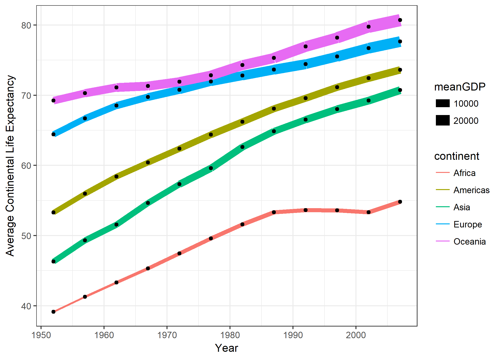

# Homework Assignment 5
By: Jennica Nichols  
October 10, 2017  
This is the fifth and final homework assignment for STAT 545.

# Factor Management
The goal of this section is to (i) define factor variables, (ii) drop factor levels, and (iii) reorder levels. I will be using the **gapminder** data set.

## Task 1
**Drop Oceania.** Filter the Gapminder data to remove observations associated with the continent of Oceania. Additionally, remove unused factor levels. Provide concrete information on the data before and after removing these rows and Oceania; address the number of rows and the levels of the affected factors.

```r
# load libraries
library(gapminder)
library(tidyverse)

# Before changing factors
str(gapminder)
```

```
## Classes 'tbl_df', 'tbl' and 'data.frame':	1704 obs. of  6 variables:
##  $ country  : Factor w/ 142 levels "Afghanistan",..: 1 1 1 1 1 1 1 1 1 1 ...
##  $ continent: Factor w/ 5 levels "Africa","Americas",..: 3 3 3 3 3 3 3 3 3 3 ...
##  $ year     : int  1952 1957 1962 1967 1972 1977 1982 1987 1992 1997 ...
##  $ lifeExp  : num  28.8 30.3 32 34 36.1 ...
##  $ pop      : int  8425333 9240934 10267083 11537966 13079460 14880372 12881816 13867957 16317921 22227415 ...
##  $ gdpPercap: num  779 821 853 836 740 ...
```

```r
summary(gapminder)
```

```
##         country        continent        year         lifeExp     
##  Afghanistan:  12   Africa  :624   Min.   :1952   Min.   :23.60  
##  Albania    :  12   Americas:300   1st Qu.:1966   1st Qu.:48.20  
##  Algeria    :  12   Asia    :396   Median :1980   Median :60.71  
##  Angola     :  12   Europe  :360   Mean   :1980   Mean   :59.47  
##  Argentina  :  12   Oceania : 24   3rd Qu.:1993   3rd Qu.:70.85  
##  Australia  :  12                  Max.   :2007   Max.   :82.60  
##  (Other)    :1632                                                
##       pop              gdpPercap       
##  Min.   :6.001e+04   Min.   :   241.2  
##  1st Qu.:2.794e+06   1st Qu.:  1202.1  
##  Median :7.024e+06   Median :  3531.8  
##  Mean   :2.960e+07   Mean   :  7215.3  
##  3rd Qu.:1.959e+07   3rd Qu.:  9325.5  
##  Max.   :1.319e+09   Max.   :113523.1  
## 
```
Without any manipulation, the data set has 1704 observations with 142 countries included. The average life expectancy is 59.47 years (median = 60.71 years) showing a slight right skew. The average GDP per capita is $7,215 dollars per person (median = $3,532 per person) showing a significant left skew in the data. 


```r
#filter out Oceania and drop unused factors; describe new dataset
str(gapminder %>%
  filter(continent != "Oceania") %>%
  droplevels())
```

```
## Warning: package 'bindrcpp' was built under R version 3.3.3
```

```
## Classes 'tbl_df', 'tbl' and 'data.frame':	1680 obs. of  6 variables:
##  $ country  : Factor w/ 140 levels "Afghanistan",..: 1 1 1 1 1 1 1 1 1 1 ...
##  $ continent: Factor w/ 4 levels "Africa","Americas",..: 3 3 3 3 3 3 3 3 3 3 ...
##  $ year     : int  1952 1957 1962 1967 1972 1977 1982 1987 1992 1997 ...
##  $ lifeExp  : num  28.8 30.3 32 34 36.1 ...
##  $ pop      : int  8425333 9240934 10267083 11537966 13079460 14880372 12881816 13867957 16317921 22227415 ...
##  $ gdpPercap: num  779 821 853 836 740 ...
```

```r
summary(gapminder %>%
  filter(continent != "Oceania") %>%
  droplevels())
```

```
##         country        continent        year         lifeExp     
##  Afghanistan:  12   Africa  :624   Min.   :1952   Min.   :23.60  
##  Albania    :  12   Americas:300   1st Qu.:1966   1st Qu.:48.08  
##  Algeria    :  12   Asia    :396   Median :1980   Median :60.34  
##  Angola     :  12   Europe  :360   Mean   :1980   Mean   :59.26  
##  Argentina  :  12                  3rd Qu.:1993   3rd Qu.:70.75  
##  Austria    :  12                  Max.   :2007   Max.   :82.60  
##  (Other)    :1608                                                
##       pop              gdpPercap       
##  Min.   :6.001e+04   Min.   :   241.2  
##  1st Qu.:2.780e+06   1st Qu.:  1189.1  
##  Median :7.024e+06   Median :  3449.5  
##  Mean   :2.990e+07   Mean   :  7052.4  
##  3rd Qu.:1.987e+07   3rd Qu.:  8943.2  
##  Max.   :1.319e+09   Max.   :113523.1  
## 
```
When you filter the data to remove Oceania, you have a slightly smaller data set with 1608 observations. The continent variable now has 4 instead of 5 levels. In this subset, you have 140 countries included meaning two have been removed. The average life expectancy is 59.26 years (median = 60.34 years), which is marginally less than the overall data set. The min and max of life expectancy is the same as the overall data set. The average and median GDP per capita are lower at $7, 052 dollars per person and $3, 450 per person respectively. The min and max GDP per capita are the same as the overall data set. 

## Task 2
**Reorder the levels of country or continent.** Use the forcats package to change the order of the factor levels, based on a principled summary of one of the quantitative variables. Consider experimenting with a summary statistic beyond the most basic choice of the median.


```r
#load library
library(forcats)

#reorder continent factors based on mean gdpPercap and visualize
  gapminder %>%
  ggplot(aes(fct_reorder(continent, gdpPercap, fun = mean), lifeExp)) +
  geom_point(aes(colour = year))
```

<!-- -->

```r
#reorder continent factors based on min gdpPercap and visualize
  gapminder %>%
  ggplot(aes(fct_reorder(continent, gdpPercap, fun = min), lifeExp)) +
  geom_point(aes(colour = year))  
```

<!-- -->

```r
#reorder continent factors based on max lifeExp and visualize
  gapminder %>%
  ggplot(aes(fct_reorder(continent, gdpPercap, fun = IQR), lifeExp)) +
  geom_point(aes(colour = year))  
```

<!-- -->
I first tried to reorder the continent variable based on mean GDP per capita. When visualized, this put Africa first and Oceania last meaning that Africa has the lowest average GDP per capita and Oceania had the highest average GDP per capita. In my second attempt, I reordered the continent variable based on minimum GDP per capita and visualized it. Africa again was first meaning it had the lowest minimum GDP per capita of all the continents and Oceania was last meaning it had the largest minimum GDP per capita. The order of the other continents was different between the two graphs showing there was a difference between average GDP per capita and minimum GDP per capita. Lastly, I tried reordering the continent variable based on the interquartile range (IQR) of GDP per capita. Africa was first meaning it had the smallest IQR of all the continents and Europe was last meaning it had the largest IQR of all the continents. 

## Task 3
Explore the effects of arrange().Note: these explorations should involve the data, the factor levels, and some figures.
1. Does merely arranging the data have any effect on, say, a figure?

```r
#original data set
gapminder
```

```
## # A tibble: 1,704 x 6
##        country continent  year lifeExp      pop gdpPercap
##         <fctr>    <fctr> <int>   <dbl>    <int>     <dbl>
##  1 Afghanistan      Asia  1952  28.801  8425333  779.4453
##  2 Afghanistan      Asia  1957  30.332  9240934  820.8530
##  3 Afghanistan      Asia  1962  31.997 10267083  853.1007
##  4 Afghanistan      Asia  1967  34.020 11537966  836.1971
##  5 Afghanistan      Asia  1972  36.088 13079460  739.9811
##  6 Afghanistan      Asia  1977  38.438 14880372  786.1134
##  7 Afghanistan      Asia  1982  39.854 12881816  978.0114
##  8 Afghanistan      Asia  1987  40.822 13867957  852.3959
##  9 Afghanistan      Asia  1992  41.674 16317921  649.3414
## 10 Afghanistan      Asia  1997  41.763 22227415  635.3414
## # ... with 1,694 more rows
```

```r
gapminder %>%
  ggplot(aes(continent, lifeExp)) +
  geom_point(aes(colour = year)) 
```

<!-- -->

```r
#arranging by gdpPercap

gapminder %>%
  arrange(gdpPercap)
```

```
## # A tibble: 1,704 x 6
##             country continent  year lifeExp      pop gdpPercap
##              <fctr>    <fctr> <int>   <dbl>    <int>     <dbl>
##  1 Congo, Dem. Rep.    Africa  2002  44.966 55379852  241.1659
##  2 Congo, Dem. Rep.    Africa  2007  46.462 64606759  277.5519
##  3          Lesotho    Africa  1952  42.138   748747  298.8462
##  4    Guinea-Bissau    Africa  1952  32.500   580653  299.8503
##  5 Congo, Dem. Rep.    Africa  1997  42.587 47798986  312.1884
##  6          Eritrea    Africa  1952  35.928  1438760  328.9406
##  7          Myanmar      Asia  1952  36.319 20092996  331.0000
##  8          Lesotho    Africa  1957  45.047   813338  335.9971
##  9          Burundi    Africa  1952  39.031  2445618  339.2965
## 10          Eritrea    Africa  1957  38.047  1542611  344.1619
## # ... with 1,694 more rows
```

```r
gapminder %>%
  arrange(gdpPercap) %>%
  ggplot(aes(continent, lifeExp)) +
  geom_point(aes(colour = year)) 
```

<!-- -->
Based on the above exploration, the arrange() function reorganized the table observations based on the variable selected. In this case, it rearranged the original table (which was alphabetical based on country) to be in order based on gdpPercap variable. The first row therefore had the lowest GDP per capta. The tables therefore looked very different. When you look at the graphs though, you see that they are the same. While the underlying data table is different, both graphs are grouped by continent and look at life expectancy thus the graphs appear the same.  
  
2.  Explore the effects of reordering a factor and factor reordering coupled with arrange(). Especially, what effect does this have on a figure?

```r
#create a subset of data from only 2007
gap2007 <- 
  gapminder %>%
  filter(year == 2007)

#check the order of country variable
head(summary(gap2007$country), 10)
```

```
## Afghanistan     Albania     Algeria      Angola   Argentina   Australia 
##           1           1           1           1           1           1 
##     Austria     Bahrain  Bangladesh     Belgium 
##           1           1           1           1
```

```r
#reorder factor by gdpPercap
gap2007$country <- fct_reorder(gap2007$country, gap2007$gdpPercap, fun = min)

#check the order of country variable
head(summary(gap2007$country), 10)
```

```
##         Congo, Dem. Rep.                  Liberia                  Burundi 
##                        1                        1                        1 
##                 Zimbabwe            Guinea-Bissau                    Niger 
##                        1                        1                        1 
##                  Eritrea                 Ethiopia Central African Republic 
##                        1                        1                        1 
##                   Gambia 
##                        1
```
I first created a subset of observations from 2007. I then looked at the original factor order for the country variable, which was alphabetical starting with Afghantistan, Albania etc. I then reordered the factor based on minimum GDP per capita and relooked at the country variable. The factor was now reordered with the first two factors now being Democratic Republic of Congo followed by Liberia. When you look at both the original table and the reordered table, both tables are the same (they remain in alphabetical order). When you use str() to look at the structure, this is where you can see the difference (see country variable below).

```r
#looking at the structural differences to the datasets by using fct_reorder()
str(gapminder)
```

```
## Classes 'tbl_df', 'tbl' and 'data.frame':	1704 obs. of  6 variables:
##  $ country  : Factor w/ 142 levels "Afghanistan",..: 1 1 1 1 1 1 1 1 1 1 ...
##  $ continent: Factor w/ 5 levels "Africa","Americas",..: 3 3 3 3 3 3 3 3 3 3 ...
##  $ year     : int  1952 1957 1962 1967 1972 1977 1982 1987 1992 1997 ...
##  $ lifeExp  : num  28.8 30.3 32 34 36.1 ...
##  $ pop      : int  8425333 9240934 10267083 11537966 13079460 14880372 12881816 13867957 16317921 22227415 ...
##  $ gdpPercap: num  779 821 853 836 740 ...
```

```r
str(gap2007)
```

```
## Classes 'tbl_df', 'tbl' and 'data.frame':	142 obs. of  6 variables:
##  $ country  : Factor w/ 142 levels "Congo, Dem. Rep.",..: 19 70 72 64 101 130 132 122 30 128 ...
##  $ continent: Factor w/ 5 levels "Africa","Americas",..: 3 4 1 1 2 5 4 3 3 4 ...
##  $ year     : int  2007 2007 2007 2007 2007 2007 2007 2007 2007 2007 ...
##  $ lifeExp  : num  43.8 76.4 72.3 42.7 75.3 ...
##  $ pop      : int  31889923 3600523 33333216 12420476 40301927 20434176 8199783 708573 150448339 10392226 ...
##  $ gdpPercap: num  975 5937 6223 4797 12779 ...
```
To visualized, I plotted Life Expectancy against the newly ordered factor (country) [see above]. As you can see, the countries remain ordered by GDP per capita. 

```r
# visualize re-ordered variable
 (life <- ggplot(gap2007, aes(country, lifeExp)) +
  geom_point(aes(colour = continent)) +
    theme_bw() +
    theme(axis.text.x = element_text (hjust = 1, angle = 90, size = 5)) +
    ggtitle("Life Expectancy of 142 Countries in 2007") +
    labs(x = "Countries", y = "Life Expectancy"))
```

<!-- -->


```r
#Using arrange on the gap2007 dataset (country factor has been reordered based on min gdpPercap)  
  gap2007_life <-
  gap2007 %>%
    arrange(lifeExp)

#look at tables
gap2007
```

```
## # A tibble: 142 x 6
##        country continent  year lifeExp       pop  gdpPercap
##         <fctr>    <fctr> <int>   <dbl>     <int>      <dbl>
##  1 Afghanistan      Asia  2007  43.828  31889923   974.5803
##  2     Albania    Europe  2007  76.423   3600523  5937.0295
##  3     Algeria    Africa  2007  72.301  33333216  6223.3675
##  4      Angola    Africa  2007  42.731  12420476  4797.2313
##  5   Argentina  Americas  2007  75.320  40301927 12779.3796
##  6   Australia   Oceania  2007  81.235  20434176 34435.3674
##  7     Austria    Europe  2007  79.829   8199783 36126.4927
##  8     Bahrain      Asia  2007  75.635    708573 29796.0483
##  9  Bangladesh      Asia  2007  64.062 150448339  1391.2538
## 10     Belgium    Europe  2007  79.441  10392226 33692.6051
## # ... with 132 more rows
```

```r
gap2007_life
```

```
## # A tibble: 142 x 6
##                     country continent  year lifeExp      pop gdpPercap
##                      <fctr>    <fctr> <int>   <dbl>    <int>     <dbl>
##  1                Swaziland    Africa  2007  39.613  1133066 4513.4806
##  2               Mozambique    Africa  2007  42.082 19951656  823.6856
##  3                   Zambia    Africa  2007  42.384 11746035 1271.2116
##  4             Sierra Leone    Africa  2007  42.568  6144562  862.5408
##  5                  Lesotho    Africa  2007  42.592  2012649 1569.3314
##  6                   Angola    Africa  2007  42.731 12420476 4797.2313
##  7                 Zimbabwe    Africa  2007  43.487 12311143  469.7093
##  8              Afghanistan      Asia  2007  43.828 31889923  974.5803
##  9 Central African Republic    Africa  2007  44.741  4369038  706.0165
## 10                  Liberia    Africa  2007  45.678  3193942  414.5073
## # ... with 132 more rows
```
The first table is a subset of gapminder containing observations from 2007 only. The table looks the same as the original dataset (i.e. observations are listed in alphabetical order by country name). The second table has used the arrange() function to rearranged the dataset to put it in order based on life expectancy. This means the first entry in now Swaziland with the smallest life expectancy. The arrange function has not changed the structure of the dataframe though (see original subset and then subset where arrange has been applied - the structure is the same.)

```r
# looking at structure
str(gap2007)
```

```
## Classes 'tbl_df', 'tbl' and 'data.frame':	142 obs. of  6 variables:
##  $ country  : Factor w/ 142 levels "Congo, Dem. Rep.",..: 19 70 72 64 101 130 132 122 30 128 ...
##  $ continent: Factor w/ 5 levels "Africa","Americas",..: 3 4 1 1 2 5 4 3 3 4 ...
##  $ year     : int  2007 2007 2007 2007 2007 2007 2007 2007 2007 2007 ...
##  $ lifeExp  : num  43.8 76.4 72.3 42.7 75.3 ...
##  $ pop      : int  31889923 3600523 33333216 12420476 40301927 20434176 8199783 708573 150448339 10392226 ...
##  $ gdpPercap: num  975 5937 6223 4797 12779 ...
```

```r
str(gap2007_life)
```

```
## Classes 'tbl_df', 'tbl' and 'data.frame':	142 obs. of  6 variables:
##  $ country  : Factor w/ 142 levels "Congo, Dem. Rep.",..: 62 12 28 13 34 64 4 19 9 2 ...
##  $ continent: Factor w/ 5 levels "Africa","Americas",..: 1 1 1 1 1 1 1 3 1 1 ...
##  $ year     : int  2007 2007 2007 2007 2007 2007 2007 2007 2007 2007 ...
##  $ lifeExp  : num  39.6 42.1 42.4 42.6 42.6 ...
##  $ pop      : int  1133066 19951656 11746035 6144562 2012649 12420476 12311143 31889923 4369038 3193942 ...
##  $ gdpPercap: num  4513 824 1271 863 1569 ...
```

```r
# Reordering a factor coupled with arrange()
  ggplot(gap2007_life, aes(country, lifeExp)) +
  geom_point(aes(colour = continent)) +
    theme_bw() +
    theme(axis.text.x = element_text (hjust = 1, angle = 90, size = 5)) +
    ggtitle("Life Expectancy of 142 Countries in 2007 Using Arrange") +
    labs(x = "Countries", y = "Life Expectancy")
```

<!-- -->
Arrange() did not impact the graph as the country factor maintained its factor ordering based on the gpdPercap rather than being ordered by lifeExp.

# File I/O
Experiment with one or more of write_csv()/read_csv(), saveRDS()/readRDS(),  dput()/dget(). Create a new data set. I highly recommend you fiddle with the factor levels, i.e. make them non-alphabetical (see previous section). Explore whether this survives the round trip of writing to file then reading back in.

```r
# create new datafram
gapLifeExp <- 
gapminder %>%
 group_by(year, continent) %>%
 mutate(meanLifeExp = round(mean(lifeExp), 2),
        medianLifeExp = round(median(lifeExp), 2)) 

# reorder factor by average lifeExp
  gapLifeExp$country <- fct_reorder(gapLifeExp$country, gapLifeExp$lifeExp, fun = mean)

# write new data set as a .CSV file
  #load library
  library(readr)

 #save working directory path
  dir <- getwd()
  
#write file  
write_csv(gapLifeExp, paste(dir,  "/gapLifeExp.csv", sep = ""))  
```
The above work allowed me to create a new dataset (called gapLifeExp) as well as to reorder the country factor to be based on mean life expectancy. I saved the data set as a .csv file. Next, I will remove the data set from my working environment and import the newly created .csv file to see if the factor reordering has been maintained. 


```r
# remove gapLifeExp
rm(gapLifeExp)

# read CSV file into working environment
gapLifeExp <- read_csv("gapLifeExp.csv")
```

```
## Parsed with column specification:
## cols(
##   country = col_character(),
##   continent = col_character(),
##   year = col_integer(),
##   lifeExp = col_double(),
##   pop = col_integer(),
##   gdpPercap = col_double(),
##   meanLifeExp = col_double(),
##   medianLifeExp = col_double()
## )
```

```r
# look at the structure of the new dataframe
str(gapLifeExp)
```

```
## Classes 'tbl_df', 'tbl' and 'data.frame':	1704 obs. of  8 variables:
##  $ country      : chr  "Afghanistan" "Afghanistan" "Afghanistan" "Afghanistan" ...
##  $ continent    : chr  "Asia" "Asia" "Asia" "Asia" ...
##  $ year         : int  1952 1957 1962 1967 1972 1977 1982 1987 1992 1997 ...
##  $ lifeExp      : num  28.8 30.3 32 34 36.1 ...
##  $ pop          : int  8425333 9240934 10267083 11537966 13079460 14880372 12881816 13867957 16317921 22227415 ...
##  $ gdpPercap    : num  779 821 853 836 740 ...
##  $ meanLifeExp  : num  46.3 49.3 51.6 54.7 57.3 ...
##  $ medianLifeExp: num  44.9 48.3 49.3 53.7 57 ...
##  - attr(*, "spec")=List of 2
##   ..$ cols   :List of 8
##   .. ..$ country      : list()
##   .. .. ..- attr(*, "class")= chr  "collector_character" "collector"
##   .. ..$ continent    : list()
##   .. .. ..- attr(*, "class")= chr  "collector_character" "collector"
##   .. ..$ year         : list()
##   .. .. ..- attr(*, "class")= chr  "collector_integer" "collector"
##   .. ..$ lifeExp      : list()
##   .. .. ..- attr(*, "class")= chr  "collector_double" "collector"
##   .. ..$ pop          : list()
##   .. .. ..- attr(*, "class")= chr  "collector_integer" "collector"
##   .. ..$ gdpPercap    : list()
##   .. .. ..- attr(*, "class")= chr  "collector_double" "collector"
##   .. ..$ meanLifeExp  : list()
##   .. .. ..- attr(*, "class")= chr  "collector_double" "collector"
##   .. ..$ medianLifeExp: list()
##   .. .. ..- attr(*, "class")= chr  "collector_double" "collector"
##   ..$ default: list()
##   .. ..- attr(*, "class")= chr  "collector_guess" "collector"
##   ..- attr(*, "class")= chr "col_spec"
```
Based on the structure, the factor reordering was not maintained between writing and reading the file back into the working environment. You can tell this because the country factor is ordered alphabetically. 

# Visualization Design
The objective of this task is to create a new visualization that utilizes some learning from the course. Two major things I learned from the lecture by Dr. Munzner were:
1) People naturally interpret connected points as a trend 
2) Colour itsef does not actually make sense. You need to think about saturation, luminosity, and hue. Saturation and luminosity show order in an intuitive way while hue is good for unordered data.
  
Based on this learning, I created the following visualization. 

```r
# create subset
gapViz <- 
gapminder %>%
 group_by(year, continent) %>%
 mutate(meanLifeExp = round(mean(lifeExp), 2),
        meanPop = round(mean(pop), 2),
        meanGDP = round(mean(gdpPercap), 2)) 

#make visualization that uses hue to show different continents and lines to show trend
(gapViz_plot <-
gapViz %>%
  ggplot(aes(year, meanLifeExp)) +
  geom_line(aes(colour = continent, size = meanGDP)) +
  geom_point() +
  theme_bw() +
    labs(x = "Year", y = "Average Continental Life Expectancy"))
```

<!-- -->
The following visualization used colour and line size to add more information to the visualization. As continents are unordered, I used hue to clearly differentiate between continents. Secondly, I used line size to give some indication of the continental average GDP per capita for each year as I hypothesized a correlation between GDP per capita and life expectancy. 

# Writing Figures to File
Use ggsave() to save a plot to file and then load it into this report.


```r
ggsave("hw05_files/testPlot_bare.png")
ggsave("hw05_files/testPlot.png", plot = life, dpi = 600)
```
The default of ggsave() is save the most recently created plot as the image. It is therefore important to specific the argument "plot = (insert name of image object here)" when you want to save a plot that was not the most recently created plot. I showed this in the above code. 

When I did not specify plot, I created the following image (i.e. testPlot_bare.png):
  


  
When I did specify plot, I created the following image (i.e. testPlot.png):
  

